# GLP-1 use, obesity and diabetes costs in Germany

This project assembles official German population, obesity and disease-cost evidence with an authorized 2024 WIdO GLP-1 market extract to describe the current context for evaluating obesity-treatment reimbursement in the statutory health insurance system (GKV). It is descriptive and does not estimate treatment effects, savings, ROI or budget impact.

## Research question

When, and for whom, could reimbursement of GLP-1/GIP treatment for obesity plausibly reduce the clinical and economic burden associated with diabetes in Germany's GKV—and what can the currently available data actually support?

## Key findings

| Finding | Result | Interpretation |
|---|---:|---|
| Adult obesity prevalence | 12.2% (2003/04) → 19.7% (2023) | Increase of 7.5 percentage points; published survey estimates |
| Resident population | approximately 83.5 million (2025) | Registered population at year end |
| Direct diabetes costs | EUR 9.685 billion (2023) | ICD-10 E10–E14, all payers; diabetes mellitus diagnosis group, not limited to type 2 diabetes |
| Four included GLP-1 ingredients | 2.674 million prescriptions; EUR 582.2 million reported medicine costs (2024) | Authorized WIdO data; prescriptions are not patients and indication is unavailable |

## Data workflow

`raw public data → import and inspection → cleaning and validation → processed data → analytical notebooks and visualizations → Power BI-ready exports → measures/model documentation → dashboard and conclusions`

## Obesity development

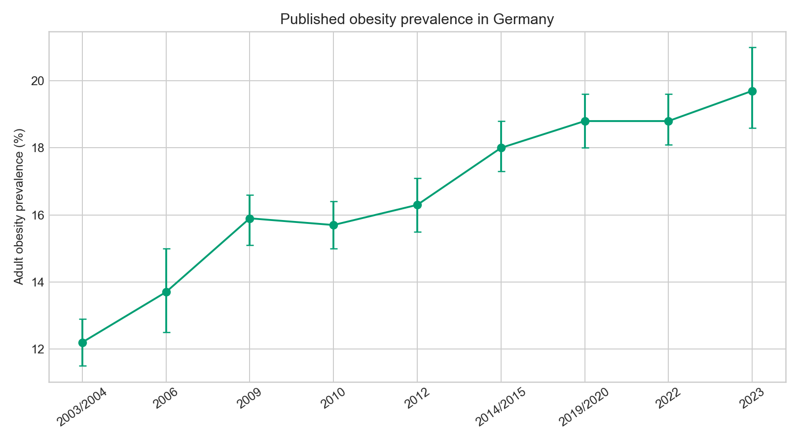

## Population structure

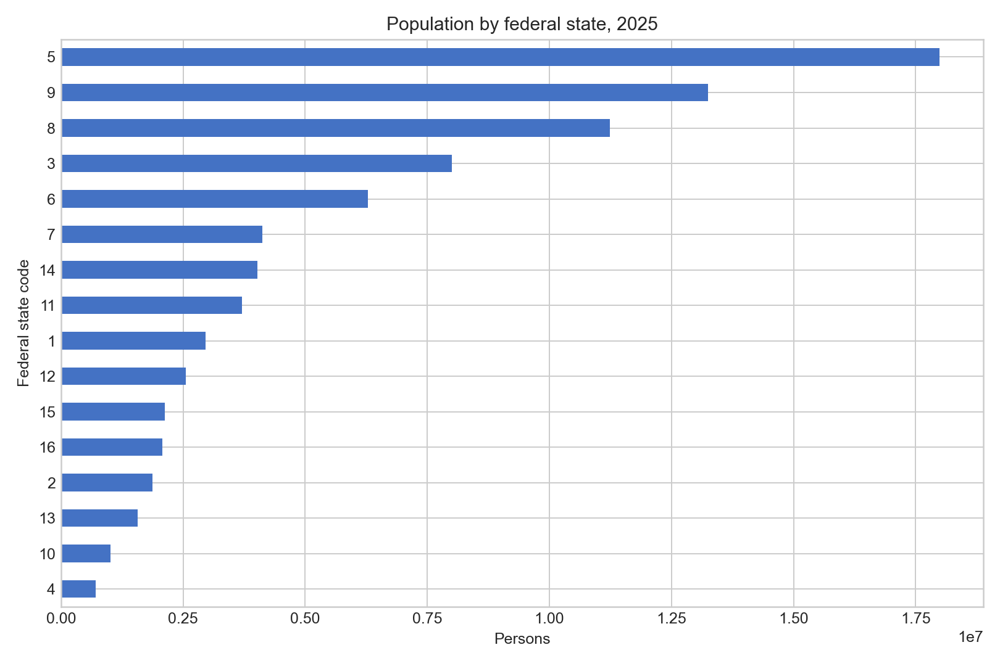

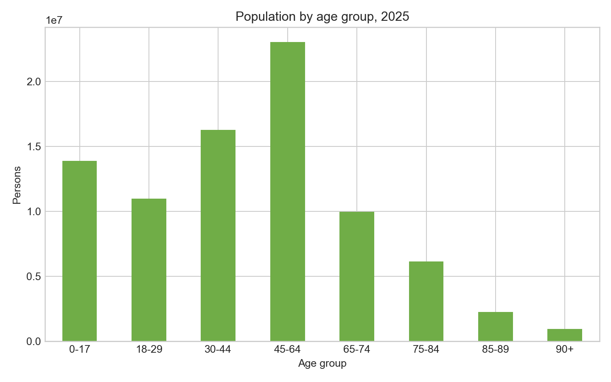

## GLP-1 market snapshot

These figures are derived analytical results from authorized external WIdO PharMaAnalyst data; the underlying observations are not redistributed.

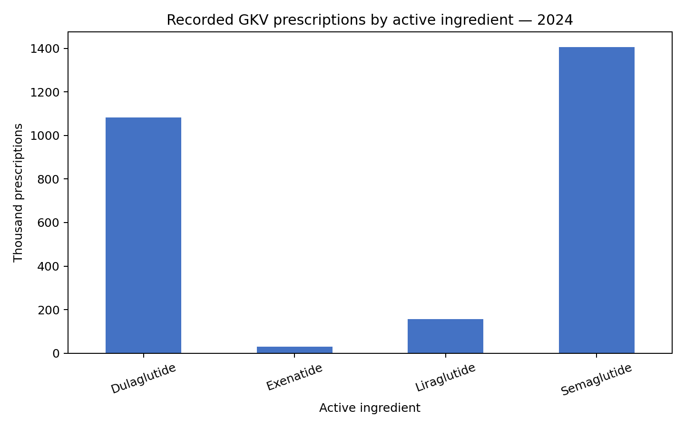

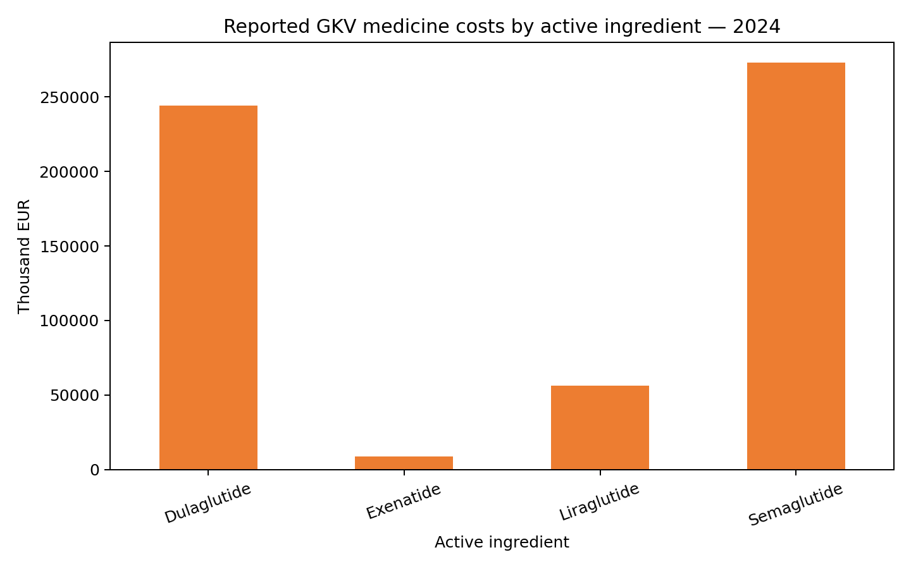

## Disease costs

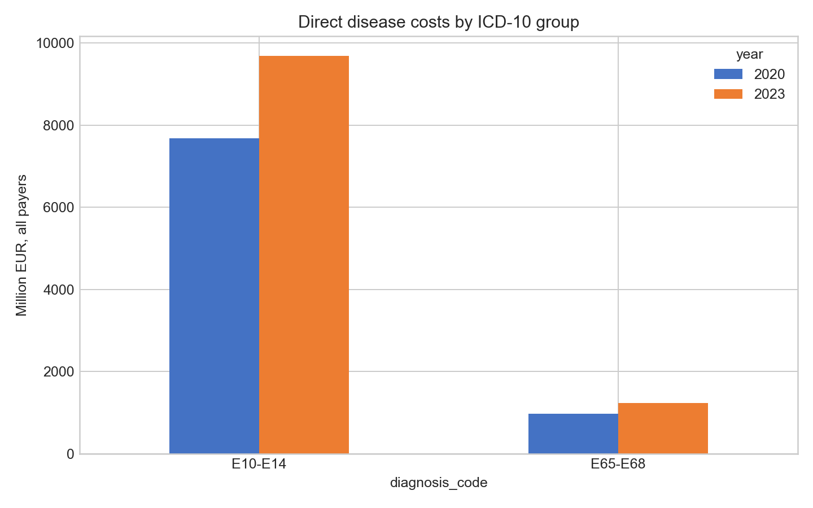

## Final Power BI dashboard

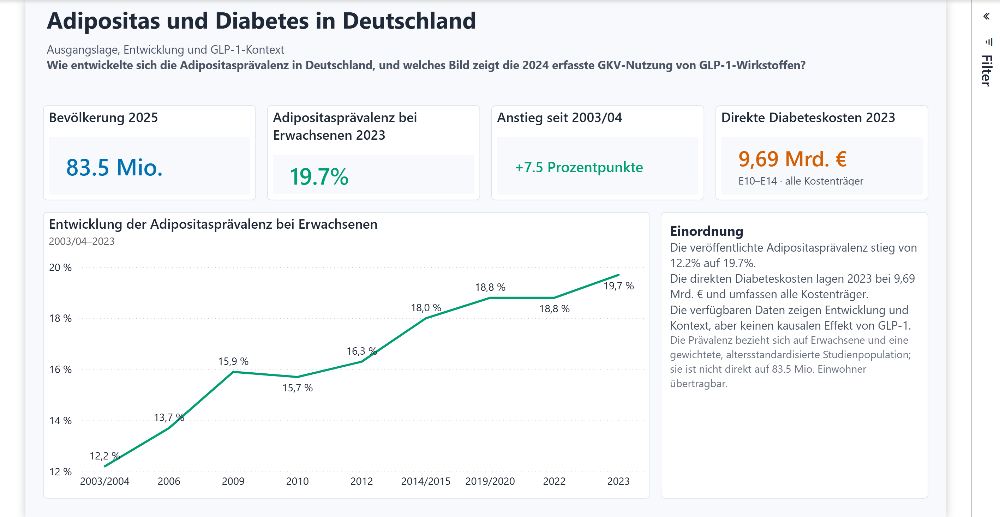

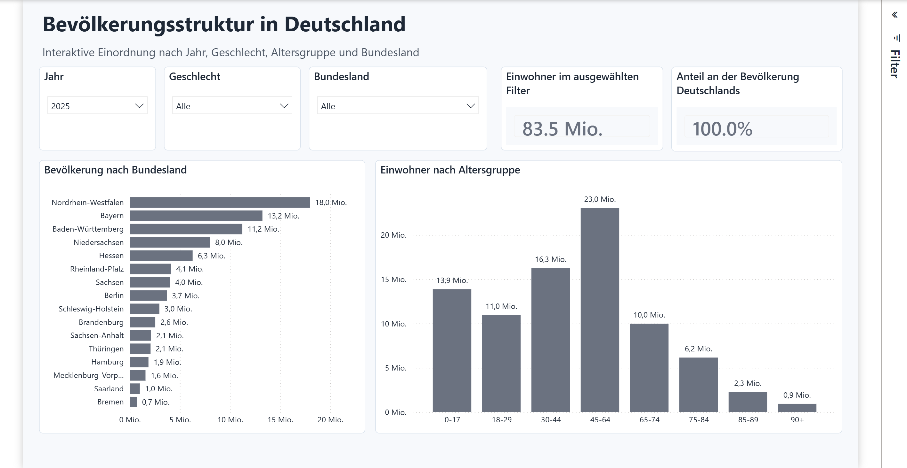

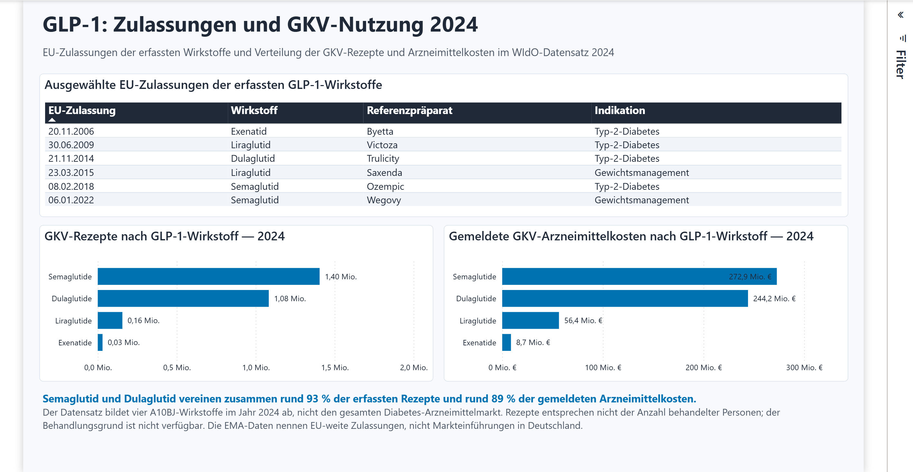

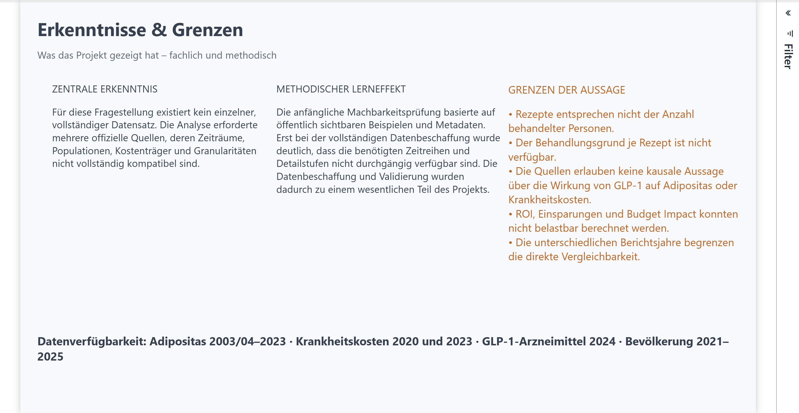

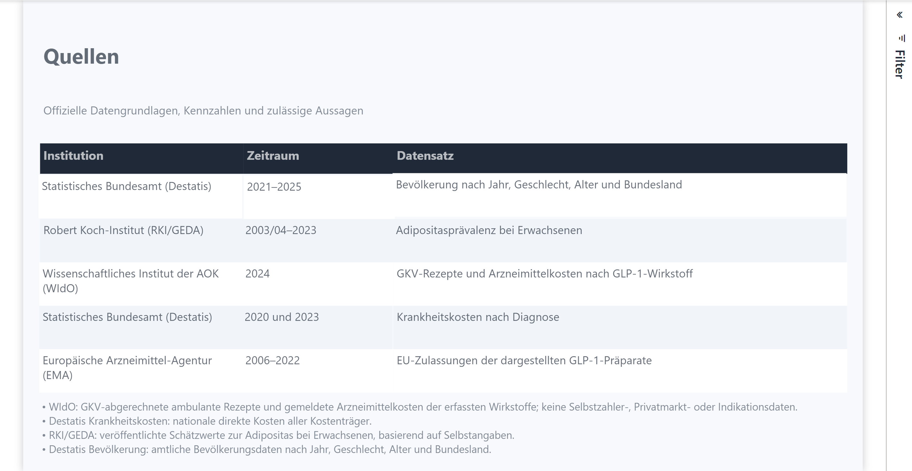

## Repository structure

- `data/`: redistributable raw, processed and Power BI-ready tables; external schema only for WIdO.
- `notebooks/`: seven executed notebooks covering import through reconciliation.
- `images/`: exported analytical figures.
- `powerbi/`: dashboard screenshots, DAX measure catalog and model documentation.
- `docs/`: concise methodology and source notes.

## Reproduction

Install [uv](https://docs.astral.sh/uv/), run `uv sync`, then execute notebooks 01–07 in order from the repository root. Notebook 07 deterministically creates `data/powerbi_exports/`. The WIdO notebook runs without a local file and prints acquisition/location guidance; full WIdO reproduction requires an authorized export at `data/external/wirkst_export.csv` matching `data/external/wido_expected_schema.csv`.

## Data and licensing limitations

Public-source tables are redistributed with provenance documented in `docs/data_sources.md`. WIdO redistribution rights were not confirmed, so neither original nor processed observations are included: that module is **reproducible with authorized external data**. Outputs and screenshots are retained as derived results. Periods and source methods differ and must not be treated as directly comparable. Prescriptions are not patients; indication is unavailable; associations are not causal. No causal effect, savings, ROI or budget impact can be inferred.
