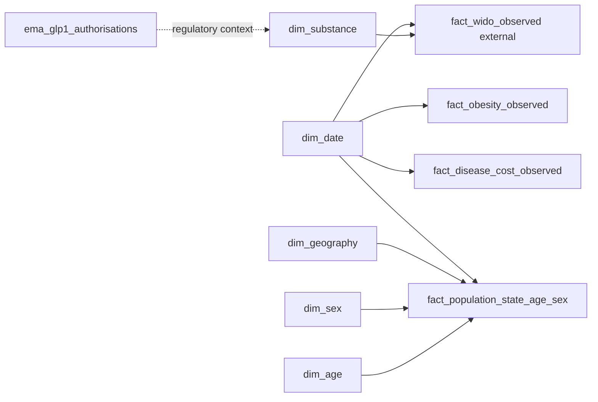

# Data model

Dimensions filter facts in a single direction. Facts retain their native grains and periods; no fact-to-fact filtering is used. The national population table supports reconciliation, while the state-age-sex table drives interactive population analysis. Auto Date tables are intentionally omitted.
